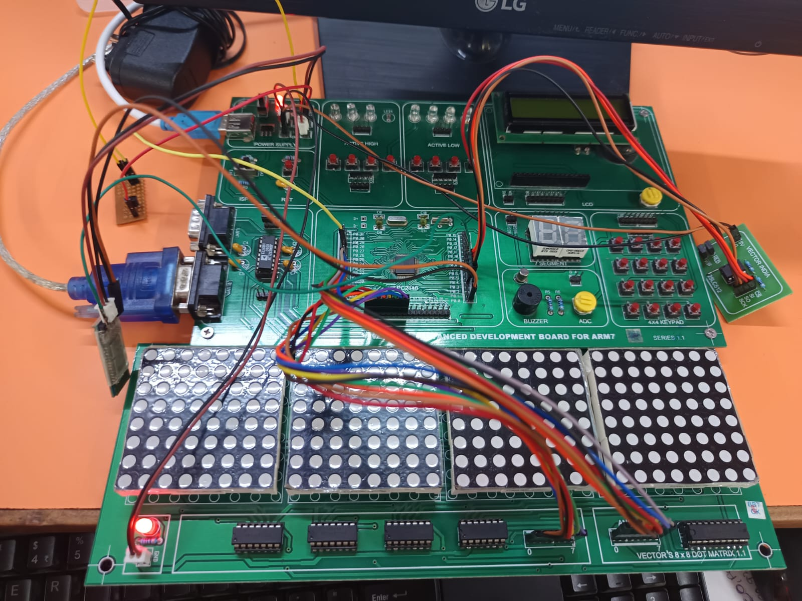

# Real-Time User-Interactive Wireless Dot-Matrix Display System

## 📌 Project Overview

The **Real-Time User-Interactive Wireless Dot-Matrix Display System** is an embedded systems project designed to customize and control display patterns on four multiplexed 8×8 dot-matrix LED displays wirelessly using a Bluetooth module. The system also integrates real-time temperature monitoring and RTC-based time and date display.

The project uses the **LPC2148 ARM7 microcontroller**, **HC-05 Bluetooth module**, **74HC164 shift registers**, **74HC573 latches**, and **LM35 temperature sensor** to provide a user-interactive wireless display solution.
## 📸 Project Demo

<div align="center">

<table>
<tr>

<td align="center" width="33%">

<br>

<b>Hardware Connections</b><br>

<sub>Temperature: 29°C | String: VECT </sub>

</td>

<td align="center" width="33%">

<br>

<b>Dot Matrix Display</b><br>

<sub>LPC2148 8×8 Dot Matrix via Bluetooth</sub>

</td>

<td align="center" width="33%">

<br>

<b>Temperature Display and Blink</b><br>

<sub>HC-05 Bluetooth</sub>

</td>

</tr>
</table>

</div>

## 🎯 Aim

To customize and control display patterns on four multiplexed 8×8 dot-matrix LED displays wirelessly using a Bluetooth module and to integrate real-time temperature monitoring into the display system.

## ✨ Features

- Wireless control using the HC-05 Bluetooth module.
- User interaction through an Android Bluetooth terminal application.
- Four multiplexed 8×8 dot-matrix LED displays.
- Fixed string display.
- Fixed string display with blinking.
- Scrolling string display.
- Minutes and seconds display.
- RTC-based time, date, and day display with scrolling.
- Temperature display using the LM35 sensor.
- Text editing through Bluetooth.
- Time and date editing through Bluetooth.
- EEPROM storage for selected mode and string data.
- UART communication using serial interrupts.

## 🛠️ Hardware Requirements

- LPC2148 ARM7 Microcontroller
- Four 8×8 Dot-Matrix Displays
- 74HC164 8-bit Serial-In Parallel-Out Shift Registers
- AT25LC512 EEPROM
- HC-05 Bluetooth Module
- LM35 Temperature Sensor
- USB-to-UART Converter

## 💻 Software Requirements

- Embedded C Programming
- Keil C Compiler
- Flash Magic

## 🔌 Hardware Connections

### 1. Dot-Matrix Display and 74HC164

The 74HC164 shift registers are used for serial-to-parallel data transfer to the dot-matrix display columns.

| Display | DSA Pin | CP Pin | Shift Register Outputs |
|---|---|---|---|
| Display 1 | P0.8 | P0.9 | Q0–Q7 → COL1–COL8 |
| Display 2 | P0.10 | P0.11 | Q0–Q7 → COL1–COL8 |
| Display 3 | P0.12 | P0.13 | Q0–Q7 → COL1–COL8 |
| Display 4 | P0.14 | P0.15 | Q0–Q7 → COL1–COL8 |

** The dot-matrix display to 74HC164 connections are fixed on the board.


## 📱 Bluetooth Communication

The HC-05 Bluetooth module is connected to the LPC2148 through the UART interface.

Instead of using a PC and HyperTerminal, the system uses an **Android Bluetooth terminal application** for user interaction.

The user can:

- Select the operating mode.
- Select display options.
- Edit fixed text.
- Edit scrolling text.
- Edit time and date.
- Exit the menu.

## 🔄 Project Working Flow

1. Power ON the system.
2. The application reads the saved mode status from EEPROM.
3. The system starts in **RUN mode** or **EDIT mode**.
4. The selected operation continues to execute.
5. The system waits for the special character `!` through Bluetooth.
6. After receiving `!`, the menu is displayed on the Bluetooth terminal.
7. The user selects the required menu option.
8. The corresponding display operation is executed.
9. The user can return to the menu and select another operation.

## 📋 Menu Options

```text
1. FIXED STRING
2. FIXED STRING WITH BLINKING
3. STRING WITH SCROLLING
4. TIME DISPLAY
5. RTC DISPLAY WITH SCROLLING
6. TEMPERATURE DISPLAY
7. TEXT EDIT MODE
8. TIME EDIT MODE
9. EXIT
```

## 🖥️ Display Modes

### 1. Fixed String

Displays a fixed four-character string on the four dot-matrix displays.

**Example:**

```text
HELP
```

### 2. Fixed String with Blinking

Displays the stored four-character string with a blinking effect.

### 3. String with Scrolling

Displays a string containing more than four characters by scrolling it across the dot-matrix displays.

**Example:**

```text
PROJECT SUCUSSFULLY COMPLETED
```

### 4. Time Display

Reads minutes and seconds from the on-chip RTC and displays them on the dot-matrix LEDs.

**Example:**

```text
MIN SEC
45 42
45 43
45 44
```

### 5. RTC Display with Scrolling

Reads the required RTC information and displays the complete time and date as a scrolling string.

**Format:**

```text
TIME: HH:MM:SS DATE:DD/MM/YY DAY: SUN to SAT
```

**Example:**

```text
TIME: 09:30:23 DATE:17/04/2015 DAY: FRIDAY
```

### 6. Temperature Display

The LM35 sensor is connected to the LPC2148 ADC to read temperature values. The temperature is converted into a string and displayed on the dot-matrix LEDs.

**Example:**

```text
30°C
```

The temperature value is updated periodically, for example, every one second.

### 7. Text Edit Mode

The user can edit display text through the Bluetooth terminal.

- **Fixed text:** Only 4 characters.
- **Scrolling text:** Up to 20 characters.

The edited strings are stored in EEPROM.

### 8. Time Edit Mode

The user can edit the RTC time and date using the Bluetooth terminal.

**Input Format:**

```text
SS:MM:HH DAY DD/MM/YY
```

**Example:**

```text
22:10:09 01 27/02/15
```

**Day Format:**

```text
01 - SUN
02 - MON
03 - TUE
04 - WED
05 - THU
06 - FRI
07 - SAT
```

**Entry Limits:**

| Parameter | Valid Range |
|---|---|
| Seconds | 00–59 |
| Minutes | 00–59 |
| Hours | 00–23 |
| Day | 01–07 |
| Date | 01–31 |
| Month | 01–12 |
| Year | 00–99 |

## 💾 EEPROM Data Storage

EEPROM is used to store:

- Current mode status (RUN / EDIT).
- Fixed four-character string data.
- Scrolling string data.

The first three display options retrieve the stored string data from EEPROM and display it on the four dot-matrix LED modules.


## 🚀 Future Scope

The system can be further enhanced with:

- Wi-Fi or IoT-based cloud connectivity.
- Remote control through a web or mobile application.
- Multiple interconnected display units.
- Large scalable display boards for industrial and public information systems.
- Additional sensors such as humidity, gas, and light sensors.
- Mobile application-based GUI control.
- Password-protected secure access.
- Real-time data logging to cloud servers.
- Voice-controlled display updates.
- Integration with smart city infrastructure

## 📂 Suggested Repository Structure

```text
Real-Time-Wireless-Dot-Matrix-Display/
│
├── README.md
│
├── src/
│   ├── main.c
│   ├── uart.c
│   ├── uart.h
│   ├── dotmatrix.c
│   ├── dotmatrix.h
│   ├── rtc.c
│   ├── rtc.h
│   ├── adc.c
│   ├── adc.h
│   ├── eeprom.c
│   └── eeprom.h
│
├── include/
│   └── project_headers.h
│
├── docs/
│   ├── block_diagram.png
│   └── circuit_diagram.png
│
└── examples/
    └── display_patterns.txt
```

---

  **## 👨💻 Author##**'''
  
 **PUSHPA AHER**:Embedded Systems Major Project 
 **Platform**:LPC2148 8X8 DOT MATRIX|BLUETOOTH |Keil µvision| Flash Magic
